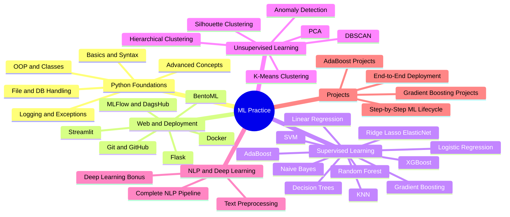
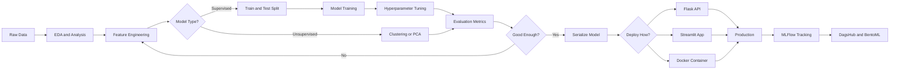
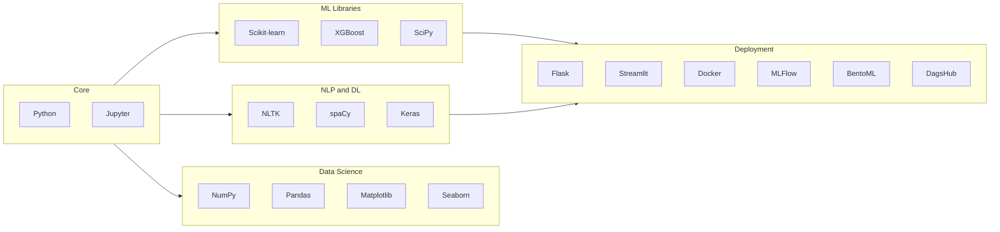
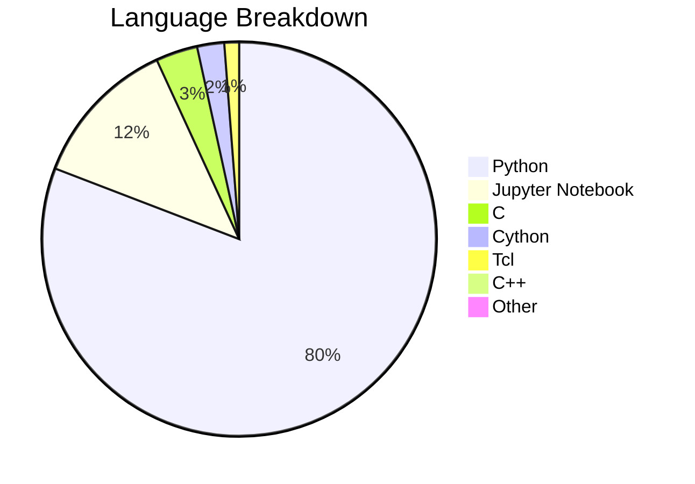

# 🤖 ML--Practice

<div align="center">


**A comprehensive, end-to-end Machine Learning & Data Science practice repository**
**from Python basics all the way to model deployment with Docker & MLFlow.**

*by [SoubhLance (Soubhik Sadhu)](https://github.com/SoubhLance)*

</div>

---

## 📦 What's Included

- ✅ Complete Python Bootcamp — 16 modules
- ✅ Complete Data Science + ML + NLP — 27 modules
- ✅ Python scripts and experiments
- ✅ Jupyter Notebooks throughout
- ✅ End-to-end project with deployment
- ✅ MLFlow, DagsHub, BentoML experiment tracking
- ✅ Docker containerisation
- ✅ NLP and Deep Learning bonus
---

## 🧩 Concept Mindmap



---

## 🔄 ML Pipeline



---

## ⚙️ Tech Stack



---

## 📚 Module Breakdown

### 🐍 Complete Python Bootcamp

| # | Module | Key Topics |
|---|--------|------------|
| 1 | Python Basics | Variables, data types, I/O |
| 2 | Control Flow | if/else, loops, comprehensions |
| 3 | Data Structures | Lists, dicts, tuples, sets |
| 4 | Functions | Args, kwargs, lambdas, closures |
| 5 | Modules | Imports, packages, pip |
| 6 | File Handling | Read/write, CSV, JSON |
| 7 | Exception Handling | try/except, custom exceptions |
| 8 | Classes & Objects | OOP, inheritance, dunder methods |
| 9 | Advanced Python | Decorators, generators, iterators |
| 10 | Data Analysis | NumPy, Pandas, Matplotlib |
| 11 | Databases | SQLite, SQLAlchemy |
| 12 | Logging | Python logging module |
| 13 | Flask | REST APIs, routing, templates |
| 14 | Streamlit | ML web app UIs |
| 15 | Memory Management | gc, memory profiling |
| 16 | Multithreading | threading, multiprocessing, GIL |

---

### 🤖 Complete Data Science + ML + NLP

| # | Module | Algorithms / Tools |
|---|--------|--------------------|
| 2 | Introduction | ML overview, EDA, feature engineering |
| 3 | Linear Regression | OLS, gradient descent |
| 4 | Ridge / Lasso / ElasticNet | Regularization techniques |
| 5 | ML Project Lifecycle | Data pipeline, cross-validation |
| 6 | Logistic Regression | Binary & multiclass classification |
| 7 | SVM | Kernel tricks, hyperplane |
| 8 | Naive Bayes | Gaussian, Multinomial + handwritten notes |
| 9 | K-Nearest Neighbor | Distance metrics, k-tuning |
| 10 | Decision Tree | CART, entropy, Gini |
| 11 | Random Forest | Bagging, feature importance |
| 12 | AdaBoost | Boosting, weak learners |
| 13 | Gradient Boosting | GBM, learning rate |
| 14 | XGBoost | Extreme gradient boosting |
| 15 | Unsupervised ML | Clustering overview |
| 16 | PCA | Dimensionality reduction |
| 17 | K-Means Clustering | Elbow method, centroids |
| 18 | Hierarchical Clustering | Dendrograms, linkage |
| 19 | DBSCAN | Density-based clustering |
| 20 | Silhouette Clustering | Cluster quality scoring |
| 21 | Anomaly Detection | Isolation Forest, LOF |
| 22 | Docker | Containerisation for ML |
| 23 | Git & GitHub | Version control for ML projects |
| 24 | End-to-End Deployment | Full ML app deployment |
| 25 | MLFlow + DagsHub + BentoML | Experiment tracking, model registry |
| 26 | Complete NLP | Tokenisation, TF-IDF, embeddings |
| 27 | Deep Learning Bonus | Neural networks intro |

---

## 📊 Language Distribution



---

## 🚀 Getting Started

```bash
git clone https://github.com/SoubhLance/ML--Practice.git
cd ML--Practice
```

```bash
# Python Bootcamp
cd Complete-Python-Bootcamp-main
pip install -r requirements.txt

# Data Science + ML
cd Complete-Data-Science-With-Machine-Learning-And-NLP-2024-main
pip install -r requirements.txt
```

```bash
jupyter notebook
```

---

## 🤝 Contributing

Contributions, suggestions, and improvements are always welcome!

1. Fork the repository
2. Create your branch: `git checkout -b feature/your-feature`
3. Commit your changes: `git commit -m 'Add some feature'`
4. Push to the branch: `git push origin feature/your-feature`
5. Open a Pull Request

---

## 📄 License

This project is licensed under the terms included in the [LICENSE](LICENSE) file.

---

<div align="center">

**Made with ❤️ by [Soubhik Sadhu](https://github.com/SoubhLance)**

*If this helped you, drop a ⭐ on the repo!*

</div>
